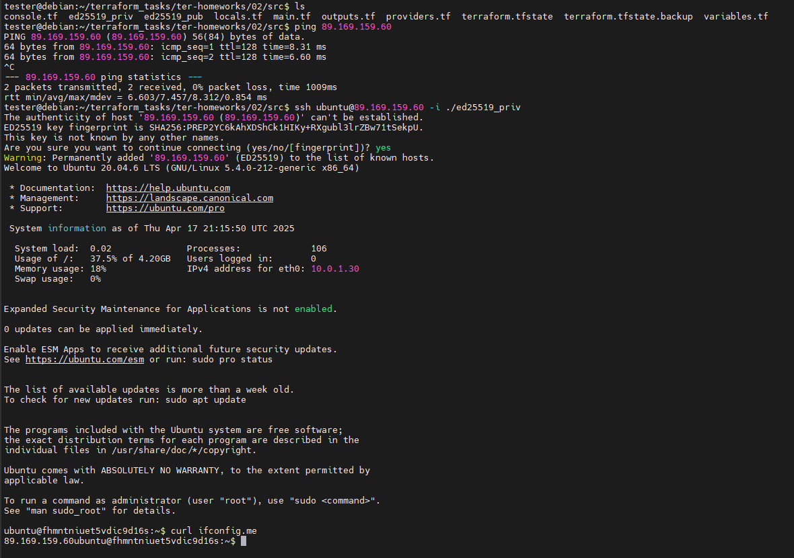
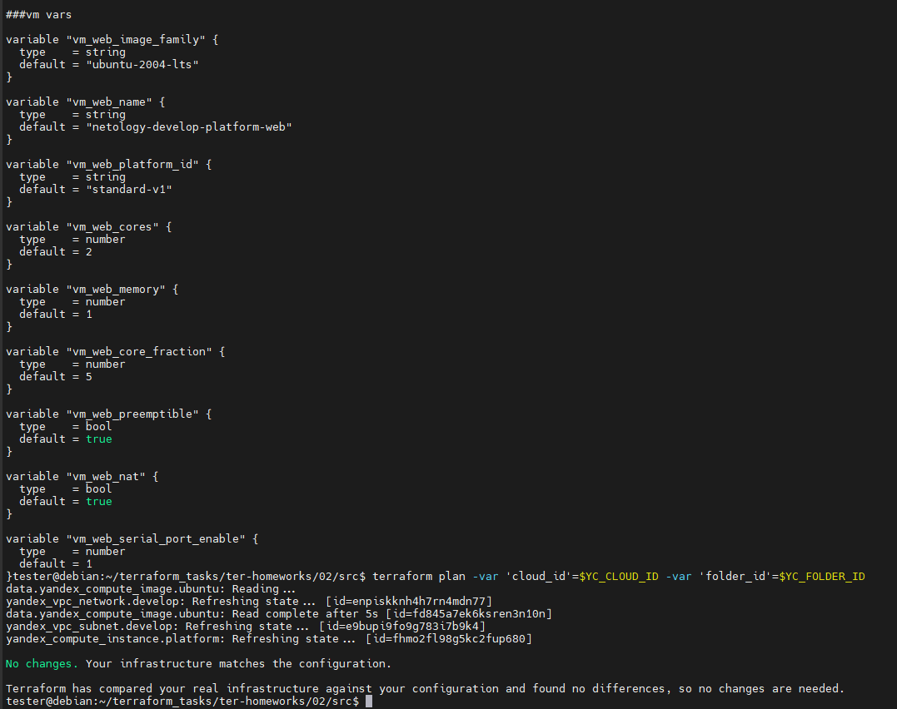
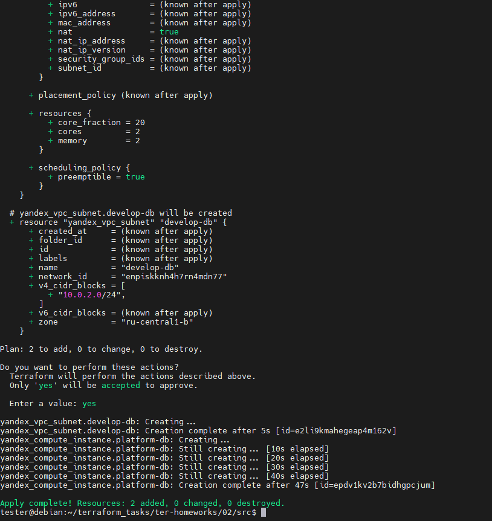
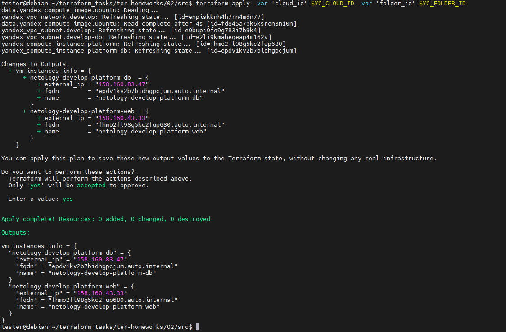
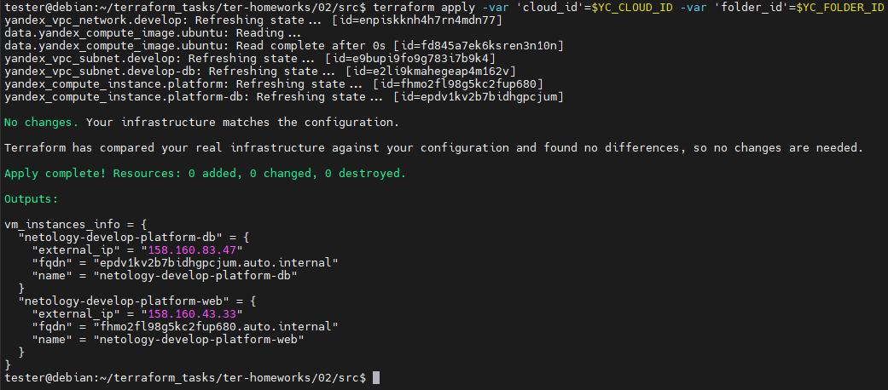

# Домашнее задание к занятию «Основы Terraform. Yandex Cloud»

https://github.com/netology-code/ter-homeworks/blob/main/02/hw-02.md

### Цели задания

1. Создать свои ресурсы в облаке Yandex Cloud с помощью Terraform.
2. Освоить работу с переменными Terraform.


### Чек-лист готовности к домашнему заданию

1. Зарегистрирован аккаунт в Yandex Cloud.
2. Установлен инструмент Yandex CLI.
3. Исходный код для выполнения задания расположен в директории [**02/src**](https://github.com/netology-code/ter-homeworks/tree/main/02/src).


### Задание 0

1. Ознакомьтесь с [документацией к security-groups в Yandex Cloud](https://cloud.yandex.ru/docs/vpc/concepts/security-groups?from=int-console-help-center-or-nav). 


### Задание 1
В качестве ответа всегда полностью прикладывайте ваш terraform-код в git.
Убедитесь что ваша версия **Terraform** ~>1.8.4

1. Изучите проект. В файле variables.tf объявлены переменные для Yandex provider.
2. Создайте сервисный аккаунт и ключ. [service_account_key_file](https://terraform-provider.yandexcloud.net).
4. Сгенерируйте новый или используйте свой текущий ssh-ключ. Запишите его открытую(public) часть в переменную **vms_ssh_public_root_key**.
5. Инициализируйте проект, выполните код. Исправьте намеренно допущенные синтаксические ошибки. Ищите внимательно, посимвольно. Ответьте, в чём заключается их суть.
6. Подключитесь к консоли ВМ через ssh и выполните команду ``` curl ifconfig.me```.
Примечание: К OS ubuntu "out of a box, те из коробки" необходимо подключаться под пользователем ubuntu: ```"ssh ubuntu@vm_ip_address"```. Предварительно убедитесь, что ваш ключ добавлен в ssh-агент: ```eval $(ssh-agent) && ssh-add``` Вы познакомитесь с тем как при создании ВМ создать своего пользователя в блоке metadata в следующей лекции.;
8. Ответьте, как в процессе обучения могут пригодиться параметры ```preemptible = true``` и ```core_fraction=5``` в параметрах ВМ.

В качестве решения приложите:

- скриншот ЛК Yandex Cloud с созданной ВМ, где видно внешний ip-адрес;
- скриншот консоли, curl должен отобразить тот же внешний ip-адрес;
- ответы на вопросы.

### Решение 1

1. Генериурем ключи через `ssh-keygen -t ed25519`

2. Создаём переменную `vms_ssh_public_root_key` в файле `variables.tf`
    ```
    ###ssh vars

    variable "vms_ssh_public_root_key" {
    type        = string
    default     = "ssh-ed25519 AAAAC3NzaC1lZDI1NTE5AAAAIHQLavCUlHhkajt2QzOAokbIZZRKg7GptDl1sZ+5RXMo"
    description = "ssh-keygen -t ed25519"
    }
    ```

4. Создаём сервисный ключ и сохраняем его по пути `~/.authorized_key.json`, поместив `.terraformrc` в `~`, создаём переменные для удобства
    ```
    yc config profile activate sa-profile
    export YC_TOKEN=$(yc iam create-token)
    export YC_CLOUD_ID=$(yc config get cloud-id)
    export YC_FOLDER_ID=$(yc config get folder-id)

    ```

5. Инициализируем проект через `terraform init`, выполняем код через `terraform apply -var 'cloud_id'=$YC_CLOUD_ID -var 'folder_id'=$YC_FOLDER_ID` и исправляем ошибки - в `main.tf` надо указать имя публичного ключа, а не приватного, а также в `main.tf` сменить platform_id на корректный отсюда https://yandex.cloud/ru/docs/compute/concepts/vm-platforms + core_numbers

6. Подключаемся к консоли ВМ через ssh и выполняем curl ifconfig.me
    
    

7. Как в процессе обучения могут пригодиться параметры ```preemptible = true``` и ```core_fraction=5``` в параметрах ВМ
    ```
    Параметр preemptible = true  - прерываемая виртуальная машина
    Параметр core_fraction = 5 - значение 5 означает, что базовая производительность ядра составляет 5% от максимальной

    Эти параметры помогут в первую очередь сэкономить на тестировании и обучении
    ```

### Задание 2

1. Замените все хардкод-**значения** для ресурсов **yandex_compute_image** и **yandex_compute_instance** на **отдельные** переменные. К названиям переменных ВМ добавьте в начало префикс **vm_web_** .  Пример: **vm_web_name**.
2. Объявите нужные переменные в файле variables.tf, обязательно указывайте тип переменной. Заполните их **default** прежними значениями из main.tf. 
3. Проверьте terraform plan. Изменений быть не должно. 

### Решение 2

1. Добаляем переменные в `variables.tf`
    ```
    ###vm vars

    variable "vm_web_image_family" {
    type    = string
    default = "ubuntu-2004-lts"
    }

    variable "vm_web_name" {
    type    = string
    default = "netology-develop-platform-web"
    }

    variable "vm_web_platform_id" {
    type    = string
    default = "standard-v1"
    }

    variable "vm_web_cores" {
    type    = number
    default = 2
    }

    variable "vm_web_memory" {
    type    = number
    default = 1
    }

    variable "vm_web_core_fraction" {
    type    = number
    default = 5
    }

    variable "vm_web_preemptible" {
    type    = bool
    default = true
    }

    variable "vm_web_nat" {
    type    = bool
    default = true
    }

    variable "vm_web_serial_port_enable" {
    type    = number
    default = 1
    }
    ```

2. Правим `main.tf`
    ```
    data "yandex_compute_image" "ubuntu" {
    family = var.vm_web_image_family
    }

    resource "yandex_compute_instance" "platform" {
    name        = var.vm_web_name
    platform_id = var.vm_web_platform_id

    resources {
        cores         = var.vm_web_cores
        memory        = var.vm_web_memory
        core_fraction = var.vm_web_core_fraction
    }

    boot_disk {
        initialize_params {
        image_id = data.yandex_compute_image.ubuntu.image_id
        }
    }

    scheduling_policy {
        preemptible = var.vm_web_preemptible
    }

    network_interface {
        subnet_id = yandex_vpc_subnet.develop.id
        nat       = var.vm_web_nat
    }

    metadata = {
        serial-port-enable = var.vm_web_serial_port_enable
        ssh-keys           = "ubuntu:${var.vms_ssh_public_root_key}"
    }
    }
    ```
3. Прверяем, что при поднятой инфруструктуре план ничего не изменит `terraform plan -var 'cloud_id'=$YC_CLOUD_ID -var 'folder_id'=$YC_FOLDER_ID`
    

### Задание 3

1. Создайте в корне проекта файл 'vms_platform.tf' . Перенесите в него все переменные первой ВМ.
2. Скопируйте блок ресурса и создайте с его помощью вторую ВМ в файле main.tf: **"netology-develop-platform-db"** ,  ```cores  = 2, memory = 2, core_fraction = 20```. Объявите её переменные с префиксом **vm_db_** в том же файле ('vms_platform.tf').  ВМ должна работать в зоне "ru-central1-b"
3. Примените изменения.

### Решение 3

1. Создаём `vms_platform.tf`, переносим туда данные `vm-web` и указываем данные `vm-db`
    ```
    #vm vars

    ## vm_web

    variable "vm_web_image_family" {
    type    = string
    default = "ubuntu-2004-lts"
    }

    variable "vm_web_name" {
    type    = string
    default = "netology-develop-platform-web"
    }

    variable "vm_web_platform_id" {
    type    = string
    default = "standard-v1"
    }

    variable "vm_web_cores" {
    type    = number
    default = 2
    }

    variable "vm_web_memory" {
    type    = number
    default = 1
    }

    variable "vm_web_core_fraction" {
    type    = number
    default = 5
    }

    variable "vm_web_preemptible" {
    type    = bool
    default = true
    }

    variable "vm_web_nat" {
    type    = bool
    default = true
    }

    variable "vm_web_serial_port_enable" {
    type    = number
    default = 1
    }


    ## vm_db

    variable "vm_db_image_family" {
    type    = string
    default = "ubuntu-2004-lts"
    }

    variable "vm_db_name" {
    type    = string
    default = "netology-develop-platform-db"
    }

    variable "vm_db_platform_id" {
    type    = string
    default = "standard-v1"
    }

    variable "vm_db_cores" {
    type    = number
    default = 2
    }

    variable "vm_db_memory" {
    type    = number
    default = 2
    }

    variable "vm_db_core_fraction" {
    type    = number
    default = 20
    }

    variable "vm_db_preemptible" {
    type    = bool
    default = true
    }

    variable "vm_db_nat" {
    type    = bool
    default = true
    }

    variable "vm_db_serial_port_enable" {
    type    = number
    default = 1
    }
    ```
2. В `main.tf` создаём новый ресурс, не забыв про "ru-central1-b"
    ```
    resource "yandex_vpc_subnet" "develop-db" {
        name           = "develop-db"
        zone           = "ru-central1-b"
        network_id     = yandex_vpc_network.develop.id
        v4_cidr_blocks = ["10.0.2.0/24"]
    }
    resource "yandex_compute_instance" "platform-db" {
        name        = var.vm_db_name
        platform_id = var.vm_db_platform_id
        zone = "ru-central1-b"

        resources {
            cores         = var.vm_db_cores
            memory        = var.vm_db_memory
            core_fraction = var.vm_db_core_fraction
        }

        boot_disk {
            initialize_params {
            image_id = data.yandex_compute_image.ubuntu.image_id
            }
        }

        scheduling_policy {
            preemptible = var.vm_db_preemptible
        }

        network_interface {
            subnet_id = yandex_vpc_subnet.develop.id
            nat       = var.vm_db_nat
        }

        metadata = {
            serial-port-enable = var.vm_db_serial_port_enable
            ssh-keys           = "ubuntu:${var.vms_ssh_public_root_key}"
        }
    }
    ```
3. Применяем изменения `terraform apply -var 'cloud_id'=$YC_CLOUD_ID -var 'folder_id'=$YC_FOLDER_ID`
    

### Задание 4

1. Объявите в файле outputs.tf **один** output , содержащий: instance_name, external_ip, fqdn для каждой из ВМ в удобном лично для вас формате.(без хардкода!!!)
2. Примените изменения.

В качестве решения приложите вывод значений ip-адресов команды ```terraform output```.

### Решение 4

1. Создаём `outputs.tf` (https://github.com/yandex-cloud/terraform-provider-yandex/tree/master/examples)
    ```
    output "vm_instances_info" {
    value = {
        for vm in [
        {
            name = yandex_compute_instance.platform.name
            external_ip = yandex_compute_instance.platform.network_interface.0.nat_ip_address
            fqdn = yandex_compute_instance.platform.fqdn
        },
        {
            name = yandex_compute_instance.platform-db.name
            external_ip = yandex_compute_instance.platform-db.network_interface.0.nat_ip_address
            fqdn = yandex_compute_instance.platform-db.fqdn
        }
        ] :
        vm.name => vm
    }
    description = "Информация о всех ВМ: имя, внешний IP и полное доменное имя"
    }
    ```
2. Применяем изменения `terraform apply -var 'cloud_id'=$YC_CLOUD_ID -var 'folder_id'=$YC_FOLDER_ID`
    

### Задание 5

1. В файле locals.tf опишите в **одном** local-блоке имя каждой ВМ, используйте интерполяцию ${..} с НЕСКОЛЬКИМИ переменными по примеру из лекции.
2. Замените переменные внутри ресурса ВМ на созданные вами local-переменные.
3. Примените изменения.

### Решение 5

1. Добавляем в `locals.tf` информацию
    ```
    variable "vm_env" {
    type    = string
    default = "netology-develop-platform"
    }

    variable "vm_web" {
    type    = string
    default = "web"
    }

    variable "vm_db" {
    type    = string
    default = "db"
    }

    locals {
    vm_names = {
        web = "${var.vm_env}-${var.vm_web}"
        db = "${var.vm_env}-${var.vm_db}"
    }
    }
    ```
2. Правим `main.tf` и указываем для yandex_compute_instance имена следующим образом
    ```
    resource "yandex_compute_instance" "platform" {
    name        = local.vm_names.web
    ...
    }
    resource "yandex_compute_instance" "platform-db" {
    name        = local.vm_names.db
    ...
    }
    ```
3. Применяем изменения
    

### Задание 6

1. Вместо использования трёх переменных  ".._cores",".._memory",".._core_fraction" в блоке  resources {...}, объедините их в единую map-переменную **vms_resources** и  внутри неё конфиги обеих ВМ в виде вложенного map(object).  
   ```
   пример из terraform.tfvars:
   vms_resources = {
     web={
       cores=2
       memory=2
       core_fraction=5
       hdd_size=10
       hdd_type="network-hdd"
       ...
     },
     db= {
       cores=2
       memory=4
       core_fraction=20
       hdd_size=10
       hdd_type="network-ssd"
       ...
     }
   }
   ```
3. Создайте и используйте отдельную map(object) переменную для блока metadata, она должна быть общая для всех ваших ВМ.
   ```
   пример из terraform.tfvars:
   metadata = {
     serial-port-enable = 1
     ssh-keys           = "ubuntu:ssh-ed25519 AAAAC..."
   }
   ```  
  
5. Найдите и закоментируйте все, более не используемые переменные проекта.
6. Проверьте terraform plan. Изменений быть не должно.

### Решение 6

1. Добавляем в `vms_platform.tf` данные сложного объекта c описанием ресурсов и комментируем в этом же файле неиспользуемые переменные при использовании в `main.tf` данного объекта
    ```
    # mv_resources

    variable "vms_resources" {
    type = map(object({
        cores = number
        memory = number
        core_fraction = number
    }))
    default = {
        web = {
        cores = 2
        memory = 1
        core_fraction = 5
        },
        db = {
        cores = 2
        memory = 2
        core_fraction = 20
        }
    }
    }
    ```
2. Добавляем в `vms_platform.tf` общие метаданные и комментируем неиспользуемые переменные при использовании в `main.tf` данного объекта (в этом файлев и в файле `variables.tf` в секции `# ssh vars`)
    ```
    # vm_metadata

    variable "vm_metadata" {
    type = map(any)
    default = {
        serial-port-enable = 1
        ssh-keys = "ubuntu:ssh-ed25519 AAAAC3NzaC1lZDI1NTE5AAAAIHQLavCUlHhkajt2QzOAokbIZZRKg7GptDl1sZ+5RXMo"
    }
    }
    ```
3. Делаем замены в `main.tf`
    ```
    resource "yandex_compute_instance" "platform" {
        ...
        resources {
            cores         = var.vms_resources.web.cores
            memory        = var.vms_resources.web.memory
            core_fraction = var.vms_resources.web.core_fraction
        }
        ...
        metadata = var.vm_metadata
        ...
    }

    resource "yandex_compute_instance" "platform-db" {
        ...
        resources {
            cores         = var.vms_resources.db.cores
            memory        = var.vms_resources.db.memory
            core_fraction = var.vms_resources.db.core_fraction
        }
        ...
        metadata = var.vm_metadata
        ...
    }
    ```
4. Проверяем, что изменений нет
    
------

## Дополнительное задание (со звёздочкой*)

**Настоятельно рекомендуем выполнять все задания со звёздочкой.**   
Они помогут глубже разобраться в материале. Задания со звёздочкой дополнительные, не обязательные к выполнению и никак не повлияют на получение вами зачёта по этому домашнему заданию. 


------
### Задание 7*

Изучите содержимое файла console.tf. Откройте terraform console, выполните следующие задания: 

1. Напишите, какой командой можно отобразить **второй** элемент списка test_list.
2. Найдите длину списка test_list с помощью функции length(<имя переменной>).
3. Напишите, какой командой можно отобразить значение ключа admin из map test_map.
4. Напишите interpolation-выражение, результатом которого будет: "John is admin for production server based on OS ubuntu-20-04 with X vcpu, Y ram and Z virtual disks", используйте данные из переменных test_list, test_map, servers и функцию length() для подстановки значений.

**Примечание**: если не догадаетесь как вычленить слово "admin", погуглите: "terraform get keys of map"

В качестве решения предоставьте необходимые команды и их вывод.

------

### Задание 8*
1. Напишите и проверьте переменную test и полное описание ее type в соответствии со значением из terraform.tfvars:
```
test = [
  {
    "dev1" = [
      "ssh -o 'StrictHostKeyChecking=no' ubuntu@62.84.124.117",
      "10.0.1.7",
    ]
  },
  {
    "dev2" = [
      "ssh -o 'StrictHostKeyChecking=no' ubuntu@84.252.140.88",
      "10.0.2.29",
    ]
  },
  {
    "prod1" = [
      "ssh -o 'StrictHostKeyChecking=no' ubuntu@51.250.2.101",
      "10.0.1.30",
    ]
  },
]
```
2. Напишите выражение в terraform console, которое позволит вычленить строку "ssh -o 'StrictHostKeyChecking=no' ubuntu@62.84.124.117" из этой переменной.
------

------

### Задание 9*

Используя инструкцию https://cloud.yandex.ru/ru/docs/vpc/operations/create-nat-gateway#tf_1, настройте для ваших ВМ nat_gateway. Для проверки уберите внешний IP адрес (nat=false) у ваших ВМ и проверьте доступ в интернет с ВМ, подключившись к ней через serial console. Для подключения предварительно через ssh измените пароль пользователя: ```sudo passwd ubuntu```

### Правила приёма работы
Для подключения предварительно через ssh измените пароль пользователя: sudo passwd ubuntu  
В качестве результата прикрепите ссылку на MD файл с описанием выполненой работы в вашем репозитории. Так же в репозитории должен присутсвовать ваш финальный код проекта.

**Важно. Удалите все созданные ресурсы**.
